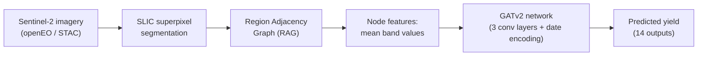

# Satellite-to-Graph Prediction

Predicting regional crop yield from Sentinel-2 satellite imagery using a Graph Attention Network (GATv2). Raw satellite images are converted into graphs via superpixel segmentation, so the model reasons over spatially coherent regions rather than raw pixels.

## Overview

Rather than feeding a CNN raw pixel grids, this project represents each satellite image as a **graph**: the image is broken into superpixels (visually homogeneous regions), each superpixel becomes a node with its mean reflectance across all 10 Sentinel-2 bands as features, and edges connect spatially adjacent regions. A Graph Attention Network then learns to aggregate information across these regions to predict a 14-dimensional yield vector for the area.

This graph-based approach keeps the input size tractable for large, high-resolution imagery while preserving spatial relationships that a simple pixel-averaging approach would lose.



## Pipeline

| Stage | File | Description |
|---|---|---|
| 1. Data acquisition | `satellite.py` | Downloads Sentinel-2 L2A imagery for Thai provinces via the openEO API, using STAC to pre-check scene availability (cloud cover, date range) before spending processing credits. Validates every downloaded GeoTIFF (band count, valid-pixel fraction, NaNs) before accepting it, retries on failure, and logs results to a manifest CSV. |
| 2. Graph construction | `processing.py` | Converts each GeoTIFF into a PyTorch Geometric `Data` object: SLIC segmentation defines superpixel regions, a Region Adjacency Graph defines edges, and per-band means become node features. Also encodes the day-of-year cyclically (sin/cos) so, e.g., Dec 31 and Jan 1 are treated as adjacent. Graphs are cached to disk and processed in parallel across images. |
| 3. Model | `model.py` | A 3-layer GATv2 network with gradient checkpointing, dropout, and a residual connection between the first two conv layers. Graph-level embeddings are pooled with mean pooling, concatenated with a node-count feature and the cyclical date encoding, then passed through a linear head to produce 14 outputs. |
| 4. Training | `train.py` | Trains with a custom weighted MSE loss (upweighting non-zero targets to counter class imbalance), log1p-transformed targets, gradient accumulation, bf16 mixed precision, gradient clipping, and `ReduceLROnPlateau` scheduling. Checkpoints the best model and periodic snapshots. |
| 5. Inference / validation | `run.py` | Loads a checkpoint, applies the saved feature normalization, runs inference on new imagery, and reports MAPE and R² against known targets. |

## Key technical details

- **Superpixel graphs instead of raw pixels** — keeps large satellite scenes computationally tractable while preserving spatial structure.
- **Weighted loss for skewed targets** — real yield/count data is dominated by zeros; the loss upweights non-zero targets so the model doesn't collapse to predicting zero everywhere.
- **Cyclical date encoding** — day-of-year is encoded as `(sin, cos)` so the model correctly treats late December and early January as close in time.
- **Memory-efficient training** — gradient checkpointing in the GNN forward pass, gradient accumulation, and bf16 autocast keep memory usage manageable on limited GPU hardware.
- **Robust data acquisition** — the satellite download pipeline pre-checks scene availability before consuming processing credits, validates every downloaded file, and retries failed acquisitions automatically.

## Project structure

```
.
├── satellite.py    # Download & validate Sentinel-2 imagery (openEO + STAC)
├── processing.py   # Convert imagery to graphs (SLIC + RAG), date encoding
├── model.py        # GATv2 architecture
├── train.py        # Training loop
├── run.py          # Inference & validation (MAPE, R²)
└── data/
    ├── data.py            # Dataset index (image filepaths → targets/dates)
    ├── raw/               # Downloaded GeoTIFFs
    ├── processed/         # Cached graph objects (.pt)
    └── checkpoints/       # Saved model checkpoints
```

## Setup

```bash
pip install torch torch_geometric torchmetrics torcheval
pip install rasterio scikit-image scipy numpy
pip install openeo pystac-client
```

Requires a Copernicus Data Space Ecosystem account for satellite downloads (`openeo.dataspace.copernicus.eu`), authenticated via `connection.authenticate_oidc()`.

## Usage

```bash
# 1. Download and validate satellite imagery for a set of regions
python satellite.py

# 2. (Optional) Pre-build graph cache from downloaded imagery
python processing.py

# 3. Train the model
python train.py

# 4. Run inference and evaluate against known targets
python run.py
```

## Possible next steps

- Cross-validate across provinces/years rather than a single held-out set
- Experiment with alternative segmentation granularities (`target_pixels_per_segment`)
- Add attention-weight visualization to interpret which regions drive predictions
- Extend to additional satellite bands or auxiliary weather data